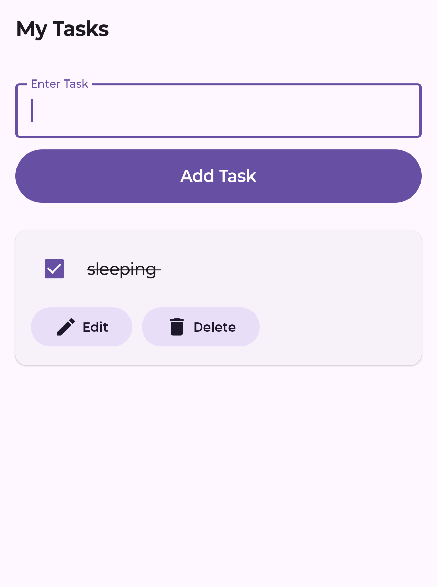
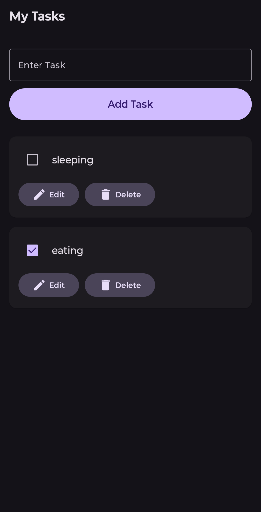
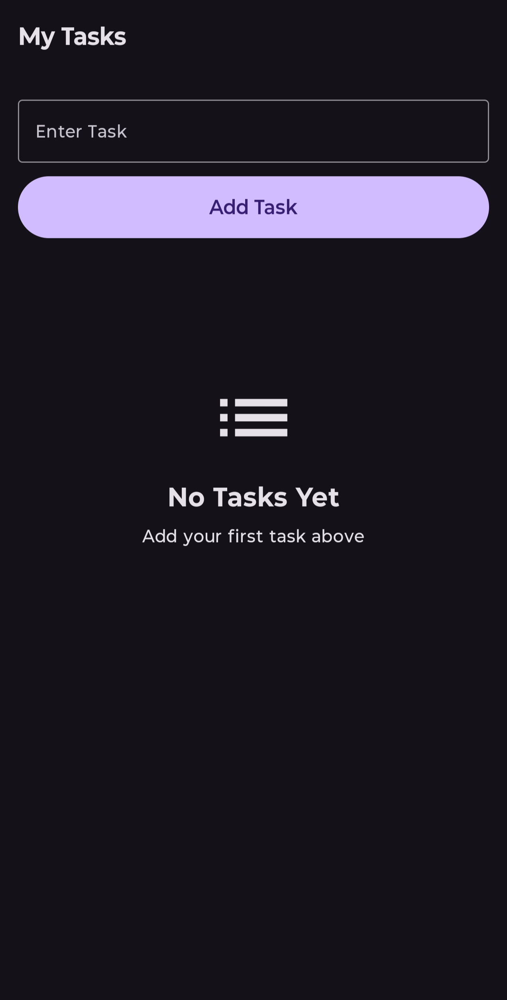
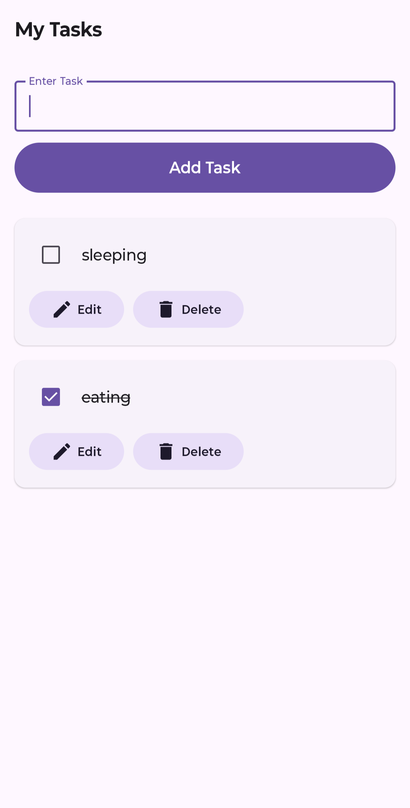
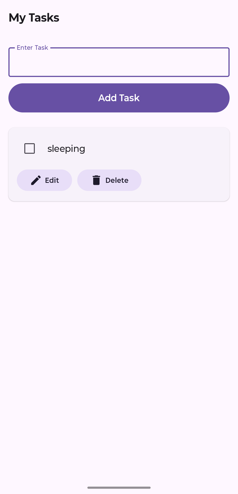

# ToDo App 📋

A modern Android To-Do application built using Kotlin, Jetpack Compose, Room Database, and MVVM Architecture.

## Features 🚀

- Add Tasks
- Edit Tasks
- Delete Tasks
- Mark Tasks as Completed
- Persistent Local Storage using Room Database
- Dark Mode Support
- Modern Material3 UI
- Empty State Screen
- Custom App Icon

## Tech Stack 🛠️

- Kotlin
- Jetpack Compose
- Room Database
- MVVM Architecture
- Material3
- Android Studio

## Screenshots 📱

## Screenshots 📱

| Add Task | Dark Mode |
|-----------|------------|
|  |  |

| Main Screen | Multiple Tasks |
|--------------|----------------|
|  |  |

| Task Screen |
|--------------|
|  |

## Installation ⚙️

1. Clone Repository

```bash
git clone https://github.com/aryangoud8978/ToDoApp.git